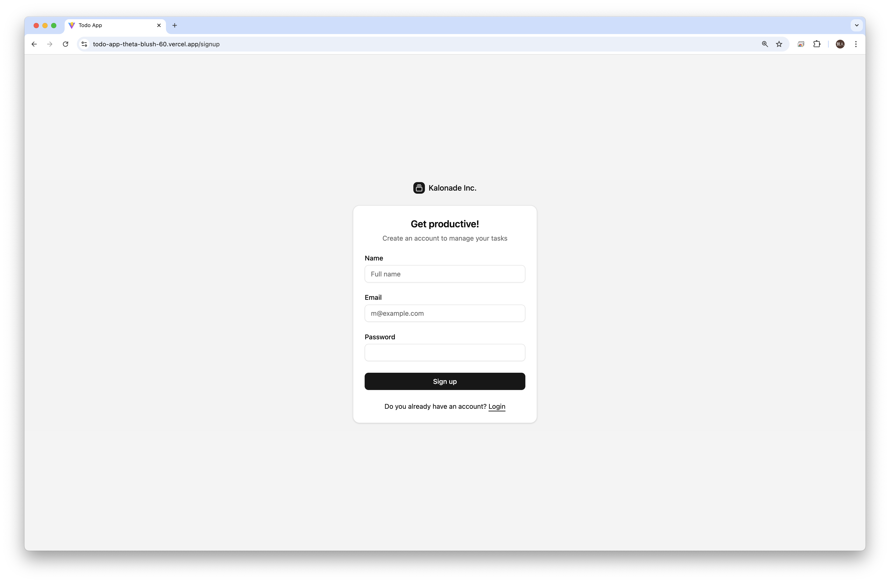
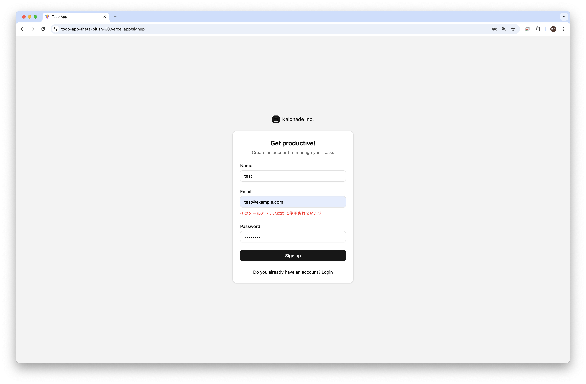
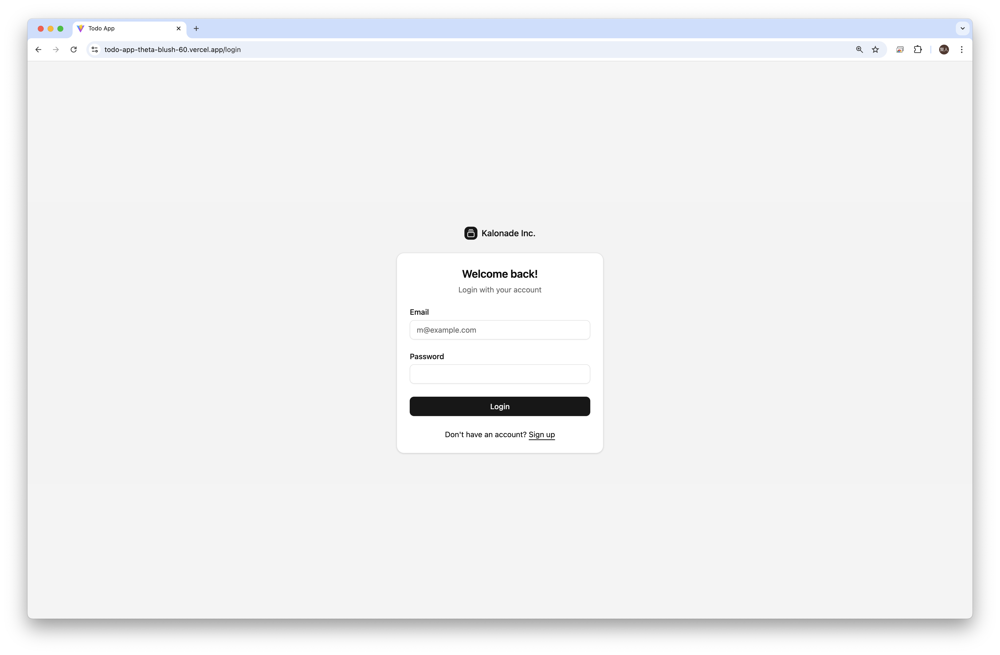
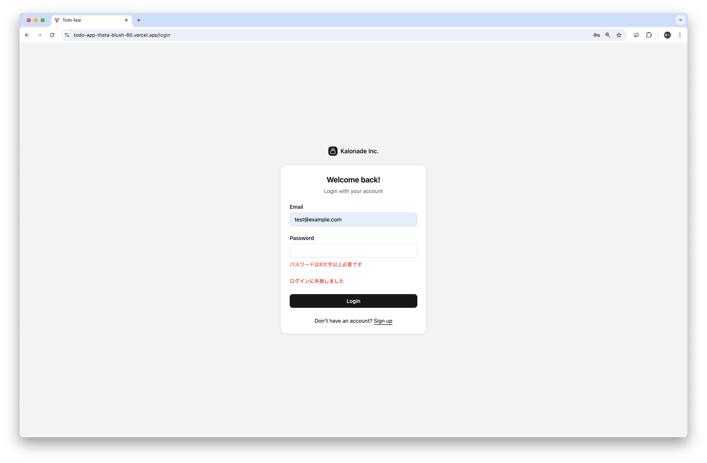
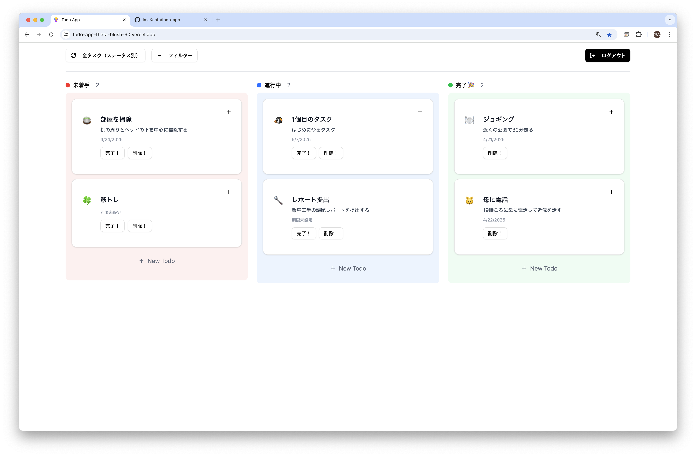
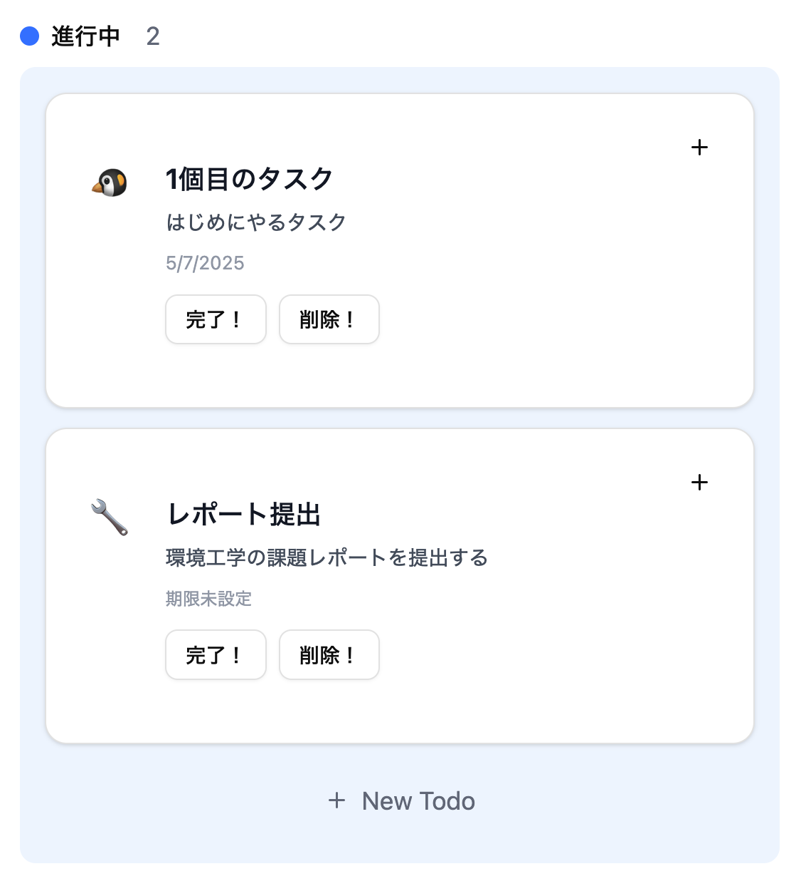
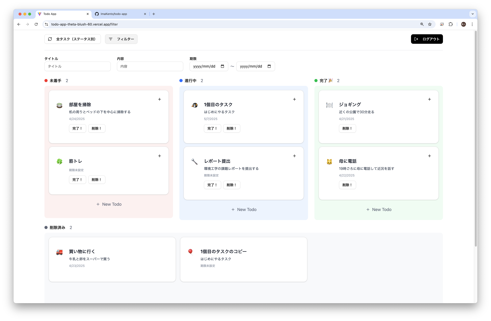

# Todo App

## アプリケーションの説明
### サインアップ画面

### サインアップのバリデーション


サインアップ画面からユーザーの登録が可能です   
emailをユニークにしており、同じメールアドレスのユーザーは登録できません

### ログイン画面


### ログインのバリデーション


ログイン画面からログインが可能です   
登録したメールアドレスとパスワードを入力し、ログインします   
ログインに成功するとJWTトークンを発行します

### メイン画面


メイン画面では、「＋ New Todo」からTodoの作成が可能です
Todoカードをドラック＆ドロップすることで、未着手・進行中・完了に変更することができます



Todoカードをクリックすることで、Todoの編集が可能です
「＋」ボタンからTodoの複製が可能です
完了・削除ボタンからTodoの完了・削除が可能です

### 検索画面


フィルター画面から、タイトル・内容・期限でのTodoの検索が可能です


## プロジェクトのディレ
```
todo-app/                                           # プロジェクトルート
├── backend                                         # Go製のバックエンドアプリケーション
│   ├── application                                 # ユースケース層（ビジネスロジック）
│   │   ├── todo                                    # Todoに関するユースケース
│   │   │   ├── create_use_case.go                  # Todo作成処理
│   │   │   ├── delete_use_case.go                  # Todo削除処理
│   │   │   ├── duplicate_use_case.go               # Todo複製処理
│   │   │   ├── get_by_id_use_case.go               # ID取得処理
│   │   │   ├── search_use_case.go                  # Todo検索処理
│   │   │   └── update_use_case.go                  # Todo更新処理
│   │   └── user                                    # Userに関するユースケース
│   │       ├── login_use_case.go                   # ログイン処理
│   │       └── signup_use_case.go                  # サインアップ処理
│   ├── cmd                                         # エントリポイント（main関数）
│   │   └── main.go                                 # サーバー起動処理
│   ├── custom-error                                # 共通エラーハンドリング
│   │   └── errors.go                               # カスタムエラー定義
│   ├── database_seeds                              # 初期データ投入用SQL
│   │   ├── todos_seed.sql                          # Todoデータの初期化
│   │   └── users_seed.sql                          # Userデータの初期化
│   ├── di                                          # 依存性注入設定（Wire使用）
│   │   ├── container.go                            # DIコンテナ定義
│   │   └── wire_gen.go                             # Wireによる自動生成ファイル
│   ├── domain                                      # ドメイン層（エンティティなど）
│   │   ├── entity                                  # エンティティ定義
│   │   │   ├── todo.go                             # Todoエンティティ
│   │   │   └── user.go                             # Userエンティティ
│   │   ├── repository                              # リポジトリインタフェース
│   │   │   ├── todo_repository_interface.go        # TodoリポジトリIF
│   │   │   └── user_repository_interface.go        # UserリポジトリIF
│   │   └── value-object                            # 値オブジェクト群
│   │       ├── body_vo.go                          # 内容（body）
│   │       ├── completed_at_vo.go                  # 完了日時
│   │       ├── due_date_vo.go                      # 期限
│   │       ├── email_vo.go                         # メールアドレス
│   │       ├── hashed_password_vo.go               # ハッシュ化パスワード
│   │       ├── name_vo.go                          # ユーザー名
│   │       ├── search_params_vo.go                 # 検索パラメータ
│   │       ├── status_vo.go                        # ステータス
│   │       ├── title_vo.go                         # タイトル
│   │       ├── todo_id_vo.go                       # TodoのID
│   │       └── user_id_vo.go                       # UserのID
│   ├── infrastructure                              # 外部連携やDB操作
│   │   ├── auth                                    # 認証関連（JWT）
│   │   │   ├── generate_jwt.go                     # JWT生成
│   │   │   └── parse_jwt.go                        # JWT解析
│   │   ├── model                                   # DBとのマッピングモデル
│   │   │   ├── todo.go                             # Todoモデル
│   │   │   └── user.go                             # Userモデル
│   │   ├── repository                              # リポジトリ実装
│   │   │   ├── todo_repository.go                  # Todoリポジトリ
│   │   │   └── user_repository.go                  # Userリポジトリ
│   │   └── supabase                                # Supabaseとの接続設定
│   │       └── supabase.go                         # クライアント初期化
│   ├── interface-adapter                           # プレゼンテーション層
│   │   ├── dto                                     # DTO定義
│   │   │   ├── request                             # リクエスト用DTO
│   │   │   │   ├── create_todo_dto.go              # Todo作成リクエスト
│   │   │   │   ├── login_dto.go                    # ログインリクエスト
│   │   │   │   ├── search_todo_dto.go              # 検索リクエスト
│   │   │   │   ├── signup_dto.go                   # サインアップリクエスト
│   │   │   │   └── update_todo_dto.go              # 更新リクエスト
│   │   │   └── response                            # レスポンス用DTO
│   │   │       ├── todo_dto.go                     # Todoレスポンス
│   │   │       └── user_dto.go                     # Userレスポンス
│   │   ├── handler                                 # HTTPハンドラー（Echo）
│   │   │   ├── todo_controller.go                  # Todoエンドポイント
│   │   │   └── user_controller.go                  # Userエンドポイント
│   │   └── middleware                              # ミドルウェア
│   │       └── auth_middleware.go                  # 認証ミドルウェア
│   └── requests                                    # HTTPリクエストサンプル
│       ├── todosReqest.http                        # Todo用リクエスト例
│       └── usersRequest.http                       # User用リクエスト例
└── frontend                                        # React + Vite 製フロントエンド
    ├── public                                      # 公開静的ファイル
    │   └── vite.svg                                # Viteのロゴ
    ├── src                                         # フロントエンドのソース
    │   ├── assets                                  # 画像やアイコンなど
    │   │   └── react.svg                           # Reactのロゴ
    │   ├── components                              # UI部品
    │   │   └── ui                                  # ボタン等の汎用UI
    │   │       ├── breadcrumb.tsx                  # パンくずリスト
    │   │       ├── button.tsx                      # ボタン
    │   │       ├── card.tsx                        # カード
    │   │       ├── collapsible.tsx                 # 折りたたみ
    │   │       ├── dialog.tsx                      # ダイアログ
    │   │       ├── dropdown-menu.tsx               # ドロップダウン
    │   │       ├── input.tsx                       # 入力欄
    │   │       ├── label.tsx                       # ラベル
    │   │       ├── popover.tsx                     # ポップオーバー
    │   │       ├── select.tsx                      # セレクトボックス
    │   │       ├── separator.tsx                   # セパレーター
    │   │       ├── sheet.tsx                       # スライドシート
    │   │       ├── sidebar.tsx                     # サイドバー
    │   │       ├── skeleton.tsx                    # スケルトン表示
    │   │       └── tooltip.tsx                     # ツールチップ
    │   ├── contexts                                # Context API定義
    │   │   └── TodoContext.tsx                     # Todo用コンテキスト
    │   ├── features                                # 機能ごとのモジュール
    │   │   ├── auth                                # 認証機能
    │   │   │   ├── components                      # ログイン・登録フォーム
    │   │   │   │   ├── LoginForm.tsx               # ログインフォーム
    │   │   │   │   └── SignupForm.tsx              # 登録フォーム
    │   │   │   ├── hooks                           # 認証用カスタムフック
    │   │   │   │   └── useAuth.ts                  # 認証状態管理
    │   │   │   ├── schemas                         # Zodスキーマ
    │   │   │   │   └── authSchema.ts               # 認証バリデーション
    │   │   │   └── service                         # API通信ロジック
    │   │   │       └── authService.ts              # 認証API
    │   │   └── todos                               # Todo機能
    │   │       ├── components                      # Todo表示用コンポーネント
    │   │       │   ├── dialogs                     # ダイアログ関連
    │   │       │   │   ├── CreateTodoDialog.tsx    # 作成用ダイアログ
    │   │       │   │   ├── DeleteTodoDialog.tsx    # 削除用ダイアログ
    │   │       │   │   └── EditTodoDialog.tsx      # 編集用ダイアログ
    │   │       │   └── list                        # カンバン表示など
    │   │       │       ├── DeletedTodoColumn.tsx   # 削除済みカラム
    │   │       │       ├── DraggableTodoCard.tsx   # ドラッグ可能カード
    │   │       │       ├── SearchColumn.tsx        # 検索結果カラム
    │   │       │       ├── SearchList.tsx          # 検索結果リスト
    │   │       │       ├── TodoColumn.tsx          # ステータスごとのカラム
    │   │       │       └── TodoList.tsx            # Todoリスト全体
    │   │       ├── hooks                           # Todo用のフック
    │   │       │   ├── useFilterTodo.tsx           # フィルタリング処理
    │   │       │   └── useTodos.ts                 # Todoの取得・更新
    │   │       ├── schemas                         # バリデーション定義
    │   │       │   └── TodoSchema.ts               # TodoのZodスキーマ
    │   │       └── service                         # 通信処理
    │   │           └── todoService.ts              # Todo API処理
    │   ├── hooks                                   # その他カスタムフック
    │   │   └── use-mobile.ts                       # モバイル判定
    │   ├── index.css                               # グローバルCSS
    │   ├── lib                                     # 汎用ユーティリティ
    │   │   └── utils.ts                            # 共通関数など
    │   ├── pages                                   # ページコンポーネント
    │   │   ├── FilterPage.tsx                      # フィルタ画面
    │   │   ├── LoginPage.tsx                       # ログイン画面
    │   │   ├── SinupPage.tsx                       # サインアップ画面
    │   │   └── TodoPage.tsx                        # メインTodo画面
    │   ├── routes                                  # ルーティング設定
    │   │   ├── PrivateRoute.tsx                    # 認証ガード
    │   │   └── index.tsx                           # ルーティング定義
    │   ├── shared                                  # 共通レイアウトやUI
    │   │   ├── button                              # ボタン関連
    │   │   │   └── NewTodoButton.tsx               # 新規作成ボタン
    │   │   └── header                              # ヘッダー関連
    │   │       └── TodoHeader.tsx                  # ヘッダーUI
    │   ├── main.tsx                                # アプリのエントリーポイント
    │   ├── App.css                                 # アプリ用CSS
    │   ├── App.tsx                                 # ルートコンポーネント
    │   └── vite-env.d.ts                           # Vite用型定義
    ├── tailwind.conf.cjs                           # Tailwindの設定ファイル
    ├── tsconfig.app.json                           # TypeScriptの設定（アプリ用）
    ├── tsconfig.json                               # 共通のTypeScript設定
    ├── tsconfig.node.json                          # Node用のTS設定
    ├── vercel.json                                 # Vercel用の設定ファイル
    └── vite.config.ts                              # Viteのビルド設定
```